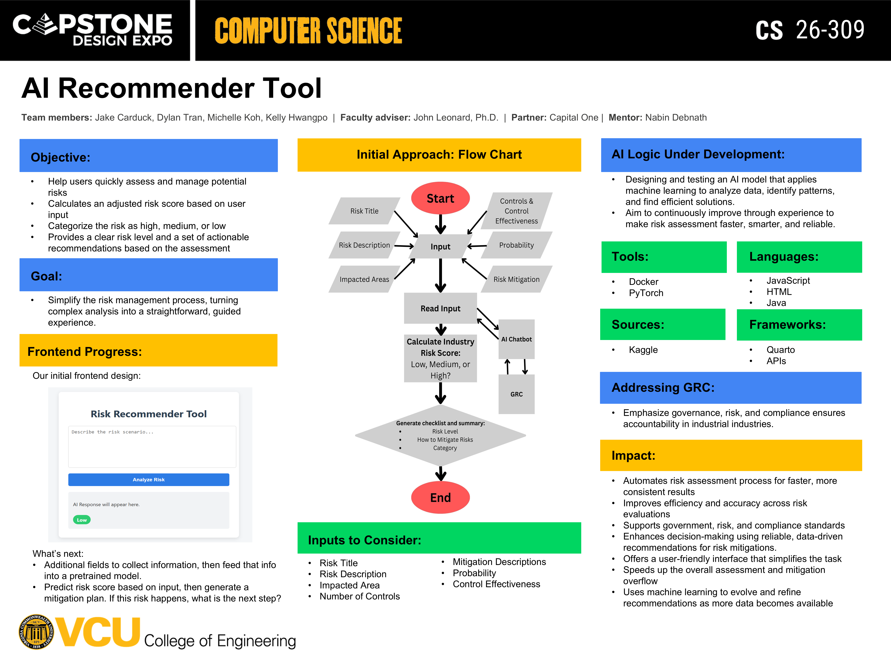

# CS-309 AI Recommender Tool  
### Course/Term: CMSC-451, Fall 2025
### Members: Jake Carduck, Michelle Koh, Kelly Hwangpo, Dylan Tran
### CS Advisor: Dr. Budwell
### Sponsor: Lakshmi Narayana Rasalay, Nabin Debnath, Capital One

# Project Summary
- This AI Risk Recommender Tool is a single-page web application designed to help users quickly assess and manage potential risks. 
- Providing several inputs, for example - risk title, risk description, impacted areas, number of controls and their descriptions to mitigate the risk, numerical values for probability, control effectiveness etc., the tool calculates an adjusted risk score.
- Categorizes the risk of input as High, Medium, or Low, providing a clear risk level and a set of actionable recommendations based on the assessment.
- This interactive tool simplifies a key part of the risk management process, turning complex analysis into a straightforward, guided experience.

# Objective
- Help users quickly assess and manage potential risks
- Calculates an adjusted risk score based on user input
- Categorize the risk as high, medium, or low
- Provides a clear risk level and a set of actionable recommendations based on the assessment

# Goal
- Simplify the risk management process, turning complex analysis into a straightforward, guided experience.

# Al Logic Under Development:
- Designing and testing an Al model that applies machine learning to analyze data, identify patterns, and find efficient solutions.
- Aim to continuously improve through experience to make risk assessment faster, smarter, and reliable.

# Addressing GRC:
- Emphasize governance, risk, and compliance ensures accountability in industrial industries.

# Impact:
- Automates risk assessment process for faster, more consistent results
- Improves efficiency and accuracy across risk evaluations
- Supports government, risk, and compliance standards • Enhances decision-making using reliable, data-driven recommendations for risk mitigations.
- Offers a user-friendly interface that simplifies the task • Speeds up the overall assessment and mitigation overflow
- Uses machine learning to evolve and refine recommendations as more data becomes available
  
# Tools
- Docker
- PyTorch

# Languages
- Java
- Javascript
- HTML

# Sources
- Kaggle

# Frameworks
- Quarto
- APIs

# Project Documents
- https://docs.google.com/document/d/1yxtVHn4Gn5V-5ajCxIlddhHRRDZyg5187LtgZrVcfNc/edit?usp=sharing
- https://docs.google.com/document/d/1CEB7q-_c5SmuJHKtnJDb9Hgyy6JIMW6KUvjxjFJ-Lkc/edit?usp=sharing
- https://docs.google.com/document/d/1-goS-lZEUnFYDHunSyDIi2aU9decmYhuPEabTzP23x0/edit?usp=sharing
- [Preliminary Report](https://docs.google.com/document/d/1888FtKfDiwHYDaa7PoqKLmUUF7wOWKmv/edit?usp=sharing&ouid=115606697901695362564&rtpof=true&sd=true)

# What's Next?
- Additional fields to collect information, then feed that info into a pretrained model.
- Predict risk score based on input, then generate a mitigation plan. If this risk happens, what is the next step?
- Develop RAG Chatbot
